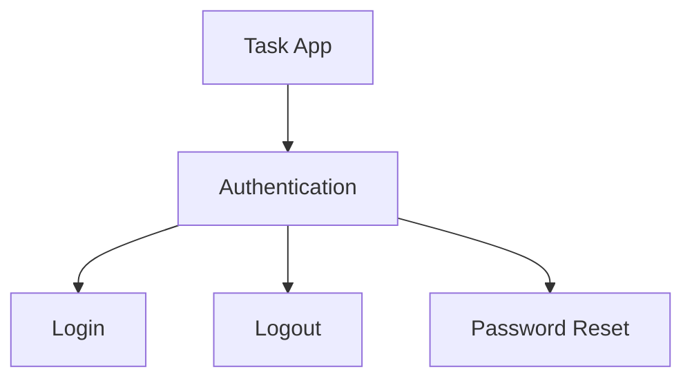

# concept-map

**Turn an AI-built project into a project you can explain and confidently change.**

concept-map is an Agent Skill for Codex and Claude Code. It organizes a project's concepts, specifications, and unresolved questions into `docs/map/`.

AI can produce a working project faster than you can understand what it contains, how it behaves, why decisions were made, and what remains undecided. We call that gap **comprehension debt**. This skill helps close it by building a map grounded in the project's documentation and implementation.

The skill ships Markdown instructions and a worked example. It includes no executable scripts and requires no Python. The instructions are in English; generated maps use the user's or project's language.

## What you get

One Markdown file per concept, connected as a tree:

- Follow branches to discover the concepts in the project.
- Open a concept to read its role and current behavior.
- Find decision rationale, open questions, and pitfalls where they matter.
- Use implementation paths and issue references to investigate further.

Open `docs/map/` as an Obsidian vault to explore the graph, or read the Markdown files directly.

For example, Login, Logout, and Password Reset share an explanation: "Verify users and manage access to their accounts." Give that explanation the name **Authentication**.



The branches provide a path to specifications. Dependencies are described in each file's body. The [worked example](references/auth-example.md) shows how to find an intermediate concept and turn it into actual files.

## Install on another machine

### Ask your agent

In Codex or Claude Code, ask:

```text
Install the skill from https://github.com/tkpsy/concept-map on this machine.
The skill is named concept-map; SKILL.md is at the repository root.
Include references/ with SKILL.md.
Let Codex and Claude Code read the same files.
If this skill is already installed, inspect its contents and location before making changes.
```

### Install manually (macOS / Linux)

Requires Git. For a machine where the skill is not yet installed, clone it to a shared location:

```bash
mkdir -p "$HOME/.local/share"
git clone --depth 1 https://github.com/tkpsy/concept-map.git "$HOME/.local/share/concept-map"
```

Link it from both tools' skill directories. If a destination already exists, this prints its location and leaves it in place:

```bash
mkdir -p "$HOME/.agents/skills" "$HOME/.claude/skills"
for concept_map_skills in "$HOME/.agents/skills" "$HOME/.claude/skills"; do
  if [ -e "$concept_map_skills/concept-map" ] || [ -L "$concept_map_skills/concept-map" ]; then
    printf 'Check the existing skill at: %s\n' "$concept_map_skills/concept-map"
  else
    ln -s "$HOME/.local/share/concept-map" "$concept_map_skills/concept-map"
  fi
done
```

These locations and symlink support follow the [Codex documentation](https://learn.chatgpt.com/docs/build-skills#where-codex-loads-local-skills) and [Claude Code documentation](https://code.claude.com/docs/en/skills#choose-where-skills-load). Use the skill in a new conversation after installation. If it does not appear, restart the app.

## Use

Open the target project and ask Codex:

```text
$concept-map
AI helped build this project, and I want to understand it.
Read the implementation and design documents, then create a concept map in docs/map/.
Make the current behavior, decision rationale, and unresolved questions easy to find.
```

In Claude Code, replace the first line with `/concept-map`.

To maintain an existing map:

```text
Use concept-map to reflect these changes in the existing docs/map/.
Update the concepts whose behavior changed and the questions that were resolved.
```

The generated `docs/map/` belongs to the target project. Share this skill independently of the maps it creates.

## Update

If you installed using the instructions above, update the shared copy for both tools:

```bash
git -C "$HOME/.local/share/concept-map" pull --ff-only
```

If you cloned elsewhere, use that location instead.

## What's included

- [SKILL.md](SKILL.md): Instructions and decision criteria for the agent, including completion checks.
- [references/auth-example.md](references/auth-example.md): A worked example of grouping concepts, writing files, and recording open questions.
- [LICENSE](LICENSE): MIT License.

The agent checks links and the tree structure using the instructions in the skill, then checks the content against the project's evidence. No bundled program is needed to use it.
