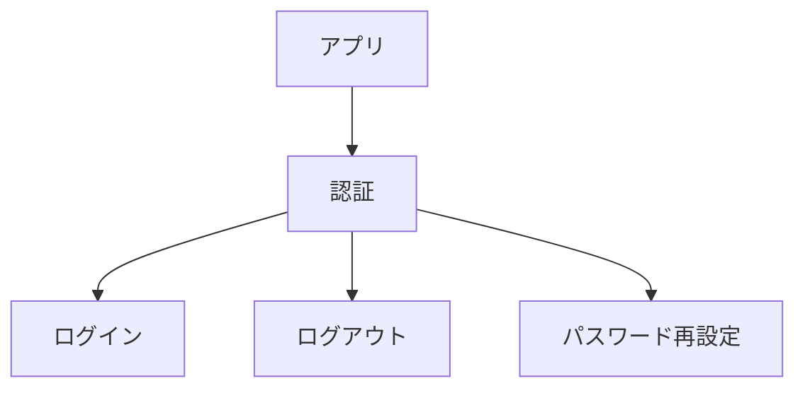

# concept-map

**AIに作ってもらったプロジェクトを、自分が説明し、変更を判断できるプロジェクトへ。**

concept-map は、プロジェクトの全体像・仕様・未解決の論点を `docs/map/` にまとめる Agent Skill です。Codex と Claude Code で使えます。

AIに実装を任せると、動くものができても「何があるか」「どう動くか」「なぜこうなったか」「何が未決定か」を理解しきれていないことがあります。この理解の遅れを、ここでは **理解負債** と呼びます。

概念マップを作り、実装や資料と照らしながら、自分が辿って説明できる状態に近づけます。

## できあがるもの

対象プロジェクトの `docs/map/` に、1概念1ファイルで Markdown を置きます。

- 木を辿って、どんな概念があるかを把握する。
- ノードを開いて、その概念の役割・現在の仕様を読む。
- 必要なノードの「経緯」「論点」「罠」で、判断の理由や残っている課題を把握する。
- コードのパスや issue の参照から、詳しく調べる場所に移る。

Obsidian で `docs/map/` を vault として開くと、親子関係がグラフになります。Markdown ファイルとして読むこともできます。

たとえば、ログイン・ログアウト・パスワード再設定を「利用者を確認し、アカウントへのアクセスを管理する」とまとめ、その説明に「認証」という名前を付けます。



枝は仕様を探すための道順です。依存関係は各ファイルの本文に書きます。
中間ノードの作り方と実際のファイルは、[導出と完成例](references/sns-example.md)にあります。

## 別の端末に入れる

### AIに頼む

別の端末の Codex または Claude Code で、次のように頼めます。

```text
https://github.com/tkpsy/concept-map のスキルを、この端末で使えるようにインストールしてください。
スキル本体はリポジトリ直下の SKILL.md、名前は concept-map です。
references/ と scripts/ も含めて取得してください。
Codex と Claude Code の両方から同じファイルを参照できるようにしてください。
既に同名のスキルがある場合は、その内容と保存先を確認して扱ってください。
```

### 手動で入れる（macOS / Linux）

Git が必要です。以下は、このスキルをまだ入れていない端末向けです。
まず共通の保存先へ clone します。

```bash
mkdir -p "$HOME/.local/share"
git clone https://github.com/tkpsy/concept-map.git "$HOME/.local/share/concept-map"
```

次に、両方のツールの読み込み先からリンクします。既存の同名フォルダがある場合は、その場所を表示して残します。

```bash
mkdir -p "$HOME/.agents/skills" "$HOME/.claude/skills"
for concept_map_skills in "$HOME/.agents/skills" "$HOME/.claude/skills"; do
  if [ -e "$concept_map_skills/concept-map" ] || [ -L "$concept_map_skills/concept-map" ]; then
    printf '既存の配置を確認してください: %s\n' "$concept_map_skills/concept-map"
  else
    ln -s "$HOME/.local/share/concept-map" "$concept_map_skills/concept-map"
  fi
done
```

配置先とリンクによる共有は、[Codex の公式ドキュメント](https://learn.chatgpt.com/docs/build-skills#where-codex-loads-local-skills)と [Claude Code の公式ドキュメント](https://code.claude.com/docs/en/skills#choose-where-skills-load)に沿っています。追加後は新しい会話で使えます。候補に出なければアプリを再起動してください。

## 使う

対象プロジェクトを開き、Codex では次のように依頼します。

```text
$concept-map
このプロジェクトはAIに実装してもらったので、全体像を把握したいです。
実装と設計書を確認して、docs/map/ に概念マップを作ってください。
現在の仕様、判断の理由、未解決の論点が辿れるようにしてください。
```

Claude Code では先頭を `/concept-map` にします。

既存のマップを育てるときにも使えます。

```text
concept-map を使って、今回の変更を既存の docs/map/ に反映してください。
仕様が変わった概念と、解決した論点を更新してください。
```

共有するのはこのスキルです。生成した `docs/map/` は、適用先のプロジェクトで管理します。

## 更新する

上の手順で入れた場合、共通の保存先を更新すると両方のツールに反映されます。

```bash
git -C "$HOME/.local/share/concept-map" pull --ff-only
```

別の場所へ clone した場合は、その保存先で実行してください。

## マップを検査する

Python 3 が使える場合、同梱スクリプトで木の構造を確認できます。追加パッケージは不要です。
対象プロジェクトのルートから実行します。

```bash
python3 "$HOME/.local/share/concept-map/scripts/check_map.py" docs/map
```

root が一つ、各非 root の親が一つ、全ノードに到達できる、循環とリンク切れがないことを検査します。
検査対象はこのスキルで使う `[[名前]]` 形式です。コード例内のリンクは除外し、同じ親子への複数の言及は一本と数えます。

構造の検査に加えて、気になる仕様を root から探し、本文を実装と照らして確認します。マップがあるだけで、内容の正しさや理解を保証できるわけではありません。

## 構成と開発

- [SKILL.md](SKILL.md)：AIが読む手順と判断基準。
- [references/sns-example.md](references/sns-example.md)：中間ノードの導出・完成例・論点の書き方。
- [scripts/check_map.py](scripts/check_map.py)：木構造の検査。
- [tests/test_check_map.py](tests/test_check_map.py)：検査スクリプトと掲載例のテスト。

このリポジトリのルートでテストできます。

```bash
python3 -m unittest discover -s tests -v
```

## ライセンス

[MIT License](LICENSE)。
